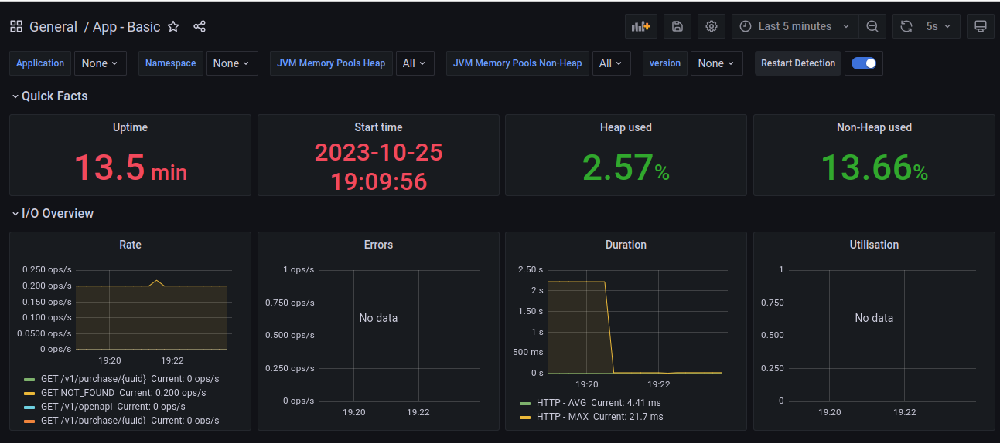
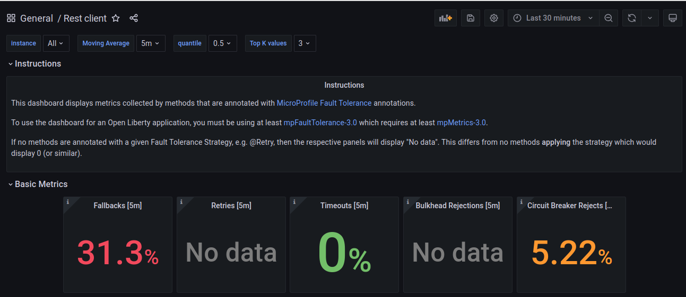
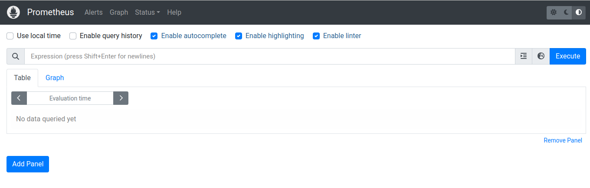
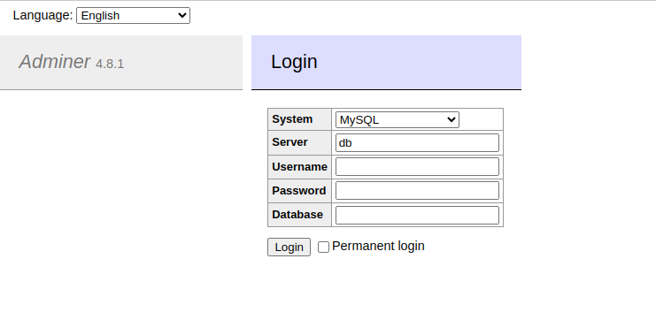
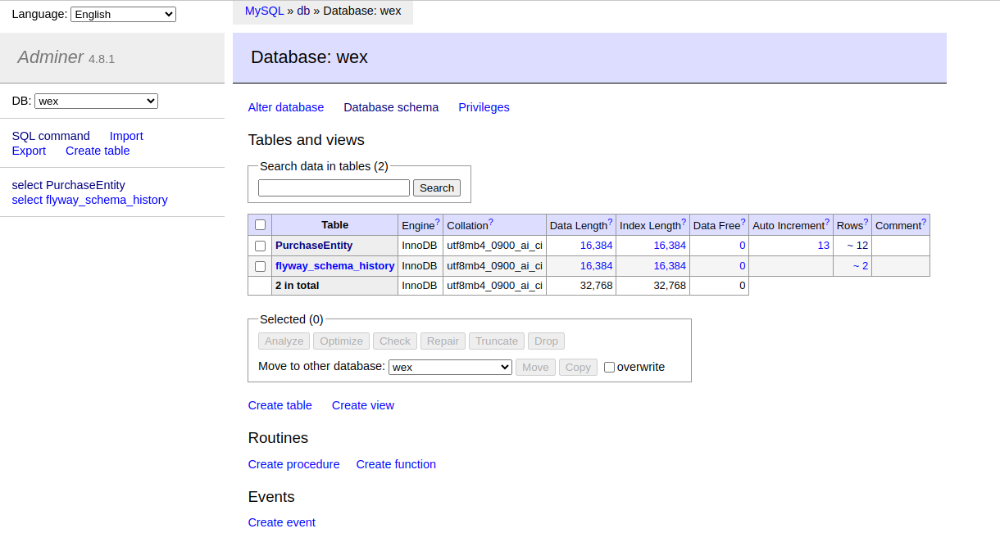
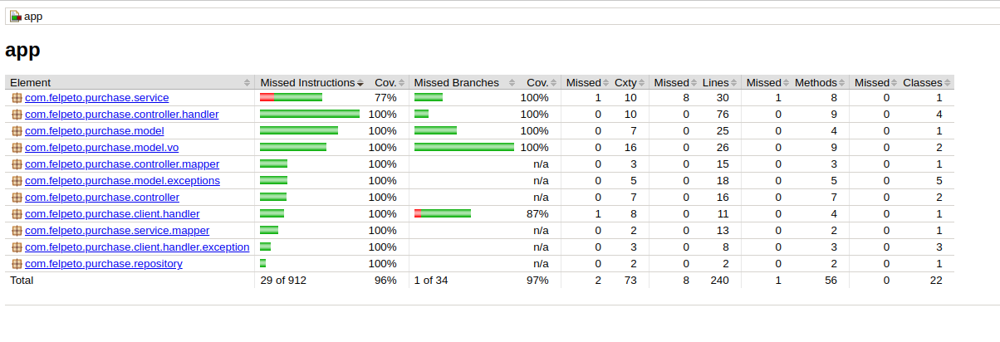
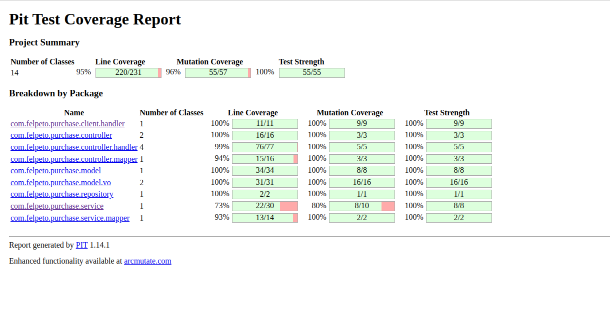
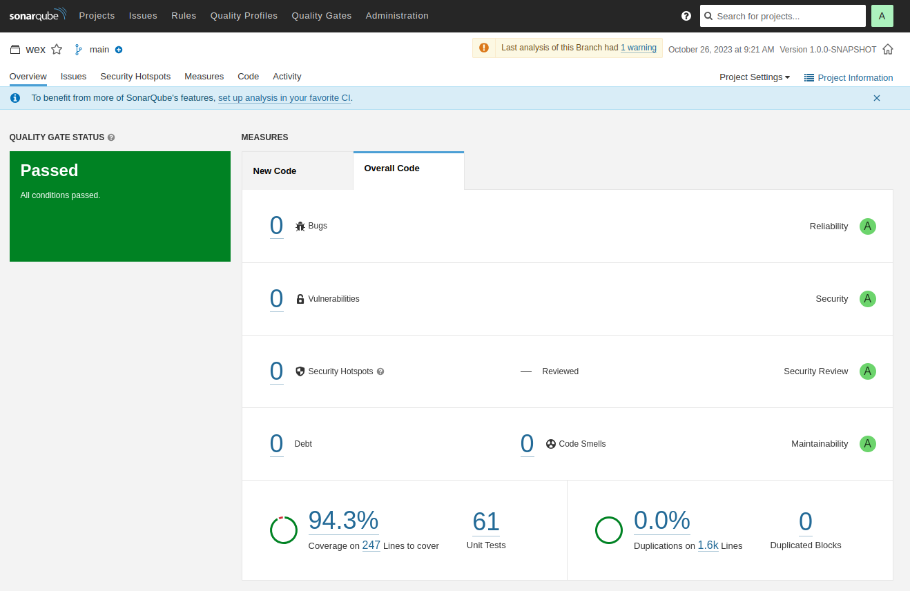

# Wex

This project uses Quarkus as framework.

## Problem to solve
### Requirement #1: Store a Purchase Transaction
Your application must be able to accept and store (i.e., persist) a purchase transaction with a description, transaction
date, and a purchase amount in United States dollars. When the transaction is stored, it will be assigned a unique
identifier.

### Requirement #2: Retrieve a Purchase Transaction in a Specified Country’s Currency
Based upon purchase transactions previously submitted and stored, your application must provide a way to retrieve the
stored purchase transactions converted to currencies supported by the Treasury Reporting Rates of Exchange API based
upon the exchange rate active for the date of the purchase.

## Running the application in dev mode

To execute the application you must navigate to .docker folder and start the stack.yaml with the command:
```shell script
docker-compose -f stack.yml -p docker up -d
```
This compose will start all the requirements for the application be able to run.
There you will find:
1. MySQL database
2. Flyway - For versionsing the database
3. Adminer - To access database
4. Rapidoc - OpenAPI Spec viewing.
5. Nginx - Reverse proxy.
6. Prometheus - To scrap metrics on our app.
7. Grafana - To show dashboards
8. Keycloak - Provides authentication for our app.

When the compose finishes got to app folder where you will execute the following command:
```shell script
./mvnw compile quarkus:dev
```

## Testing endpoints
After quarkus starts, you need to get a token at:
```shell script
curl --location 'http://localhost:8081/realms/wex/protocol/openid-connect/token' \
--header 'Content-Type: application/x-www-form-urlencoded' \
--data-urlencode 'grant_type=password' \
--data-urlencode 'client_id=backend' \
--data-urlencode 'client_secret=FOJHmE8A3ckjM5mANHLBAE72PbFIyzED' \
--data-urlencode 'username=wex-admin' \
--data-urlencode 'password=wex-admin'
```
We have two users
1. wex-admin (password wex-admin), with admin role.
2. user (password user), with user role.

Our app only accept admin role, so if ou try to access any endpoint with user, you will receive a 403 Forbidden.

After you get your token you can open your browser and access
http://localhost:5000
It will open the Rapidoc to you test, like this image:

In the authentication section you will insert the token following the format: Bearer <token> and press update. Doing this all endpoints will automatically send the Authorization header with your token.

The endpoints we have are:
* Save a new purchase (/v1/purchases)
* Retrieve a purchase (/v1/purchases/{uuid}?country=<country_name>)
Obs: If you don't want to create a new purchase, we have some preloaded for you, just see the V9999999999999__INSERT_Purchase.sql file at /resources/flyway/db/integration-test

## Monitoring application
If you access http://localhost:5000/grafana you will access our grafana dashboards.
The user and password for access is (user: admin, password: admin). After you prompt the credentials, grafana will ask you to change the password, just pick one of your choice or maintain the same.

In grafana we have two dashboards:
1. App - Basic - That monitor JVM memory consumption, CPU usage and much more information
2. Rest client - This dashboard collect data for our Fault Tolerance annotations.



If you prefer going to prometheus just access http://localhost:5000/prometheus


## Accessing database
If you like to perform some queries in database, you can access http://localhost:5000/adminer


Now you just need to complete the blank fields:
* Username: root
* Password: admin
* Database: wex


Now feel free to navigate through database.

## Testing tools
This application has a test coverage of 96% for line and mutation coverage.
### Jacoco
Jacoco is a tool to help us measure line coverage of our application

### PiTest
PiTest is a tool to measure mutation coverage in our application


### Testcontainers
For integration test it's using Testcontainers and RestAssured.
If you want to see all the integration tests, it's located at integration-test module.
Obs: I need to skip IT because I could not configure Keycloak container in time. It's always returning issuer invalid and if I skip issuer validation I receive an error at Keycloak container.

## Code Quality
### Sonar
This application was scanned by sonar. See the report below:


### Spot bugs
This application uses spotbugs to verify any vulnerability in the code.

### Checkstyle
This application uses Google checkstyle to maintain a pattern for the whole project.
